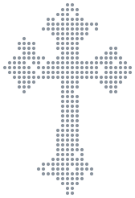

### Lucas Krawczak

I run **[Advance Labs](https://advancelabs.dev)**. I came to Canada from a military boarding
school in Poland, and now I build open-source software that developers and AI agents
actually use. *We build shit until it works.*

 

## What I'm building

**[Ninebrains](https://github.com/Advance-Labs/ninebrains)** · desktop app for running several
Claude Code and Codex agents at once, each in its own git worktree, with gates that prove the
work before it counts as done. 
Apache-2.0 · macOS, Windows, Linux · [ninebrains.runs-on.dev](https://ninebrains.runs-on.dev)

**[runs-on.dev](https://github.com/zordhalo/runs-on.dev)** · free `yourname.runs-on.dev`
subdomains for developers. The public repo is the registry, so every claim is a commit anyone
can read. 
AGPL-3.0 · 1,200+ names claimed · 432 tests · [runs-on.dev](https://runs-on.dev)

**[AEO Toolkit](https://github.com/Advance-Labs/aeo-toolkit)** · scores a site the way an AI
assistant reads it. Free in the browser, as a
[Chrome extension](https://chromewebstore.google.com/detail/aeogeo-auditor/bdkkjpbipgolopjhndknigaaokdabnad),
and over MCP; the engine behind our paid audits. 
Apache-2.0 · 54-rule engine · 988 tests · [advancelabs.dev/tools](https://advancelabs.dev/tools)

## Research and upstream

**[urban-drone-autonomy](https://github.com/Advance-Labs/urban-drone-autonomy)** · sim-first
autonomy for a multirotor, flown through five real OpenStreetMap cities; it infers powerlines
from the poles carrying them. **[Fly it in your browser](https://drone.advancelabs.dev)**. 
275 tests · first PX4 SITL flight done, full missions next · Apache-2.0

**Upstream** · two PRs to [Pane](https://github.com/dcouple/Pane)
([#572](https://github.com/dcouple/Pane/pull/572), [#573](https://github.com/dcouple/Pane/pull/573)):
pane activation from 675 ms to 332 ms, plus inline renaming and the store bug behind it.

## Also in the lab

[whoopsie-protocol](https://github.com/zordhalo/whoopsie-protocol) (reverse-engineered WHOOP 4.0 BLE) ·
[agent-handoff-protocol](https://github.com/zordhalo/agent-handoff-protocol) (move a running agent between hosts) ·
[quantum-hybrid-research](https://github.com/Advance-Labs/quantum-hybrid-research) (quantum × classical feasibility, 228-test emulator) ·
[athena-weather-mcp](https://github.com/zordhalo/athena-weather-mcp) ·
[75-day-tracker](https://github.com/zordhalo/75-day-tracker)

Advance Labs also takes a few fixed-price jobs: [AEO audits and build sprints](https://advancelabs.dev/services),
with [case studies here](https://advancelabs.dev/work).

✞ [code-cross](https://github.com/zordhalo/code-cross) · [Blessed Pier Giorgio Frassati](https://github.com/zordhalo/st-PierGiorgioFrassati), for London's altar servers
